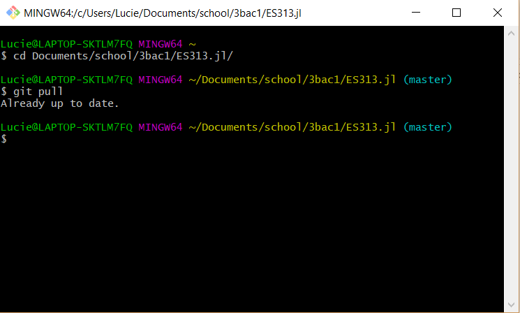

# ES313 - Quickstart guide
This is a small guide intended to put you on your way for this course. We will be working with Julia v1.2 for all applications. This is also the version you have on your CDN computer. It is recommended that you do all this before attending class, because the installation might take a while. A speedy and stable internet connection is an added value.

## CDN computer
1. Install Julia from the software center. 
2. Download the [course repository](https://github.com/BenLauwens/ES313.jl) from GitHub and extract the zip file in a folder of your choice (e.g. in 'My Documents')
3. Navigate to the `Setup` folder in the extracted folder and execute `ES313 - WINDOWS.bat`. This small script should activate Julia, fetch all relevant updates and install the required packages. 
    
    *Note:* In order to be able to install or update packages, you will need to connect to a network other than CDN as the corporate proxy blocks the updates.
4. Enjoy the course

### Tools
* You will be using the Julia REPL in combination with a Pluto notebook.
* For code development you could use Notepad++ (available in the software center). There is a [Julia language extension](https://github.com/JuliaEditorSupport/julia-NotepadPlusPlus) available for Notepad++.

## Personal computer
We try to make sure that the installation and configuration runs as smoothly as possible with a minimum of effort on your part. These guidelines work for both Windows and MacOS. Occasionally there is a small difference between the platforms that will be made clear during this walkthrough. This guide has been successfully tested on Windows 10, Windows 8.1, MacOS El Catalina.

1. Download Julia 1.2 for your platform from the [website](https://julialang.org/downloads/).
2. Install Julia 1.2
3. Download the [course repository](https://github.com/BenLauwens/ES313.jl) from GitHub and extract the zip file in a folder of your choice (e.g. in 'My Documents')
4. Navigate to the `Setup` folder in the extracted folder. If you are a MAc user, execute `ES313 - MAC.command`. If you are a Windows user, execute `ES313 - WINDOWS.bat`. TThis small script should activate Julia, fetch all relevant updates and install the required packages.
5. Enjoy the course

#### Remarks:
- On windows, you might get a warning that Windows Defender has blocked the execution of the script. Disable Windows Defender temporarily or modify the permissions for this file only.
- In the rare case that that the script should not work, you can do the following in the Julia REPL:

    ```Julia
    include("path/to/the/file/configES313.jl)
    ```
    
    
    Where obviously you replace "path/to/the/file/" with the actual location of your file.

### Tools
* You will be using the Julia REPL in combination with a Pluto notebook.
* For code development you could use Visual Studio Code or another IDE of your choosing. Most IDE's have a Julia extension available  

##  Overview of packages
List of different packages that will be used for this course:

General:
* [Logging](https://docs.julialang.org/en/v1.2/stdlib/Logging/#)
* [Dates](https://docs.julialang.org/en/v1.2/stdlib/Dates/)
* [Statistics](https://docs.julialang.org/en/v1.2/stdlib/Statistics/)
* [Distributions](https://juliastats.org/Distributions.jl/stable/)
* [HypothesisTests](https://juliastats.org/HypothesisTests.jl/stable/)
* [CSV](https://juliadata.github.io/CSV.jl/stable/)
* [JLD](https://github.com/JuliaIO/JLD.jl) (won't work on CDN, not installed by default)
* [JLD2](https://github.com/JuliaIO/JLD2.jl)

Plotting:
* [Plots](http://docs.juliaplots.org/latest/)
* [StatsPlots](https://github.com/JuliaPlots/StatsPlots.jl)
* [LaTeXStrings](https://github.com/stevengj/LaTeXStrings.jl)
* [Measures](https://github.com/JuliaGraphics/Measures.jl)
* [NativeSVG](https://github.com/BenLauwens/NativeSVG.jl)

Optimization:
* [JuMP](https://jump.dev/JuMP.jl/v0.19.0/index.html)
* [GLPK](https://github.com/jump-dev/GLPK.jl)
* [Optim](https://julianlsolvers.github.io/Optim.jl/stable/)
* [GeneralQP](https://github.com/oxfordcontrol/GeneralQP.jl)
* [NLopt](https://github.com/JuliaOpt/NLopt.jl) (won't work on CDN, not installed by default)
* [Ipopt](https://ipoptjl.readthedocs.io/en/latest/ipopt.html)

Discrete event simulation:
* [ResumableFunctions](https://github.com/BenLauwens/ResumableFunctions.jl)
* [SimJulia](https://github.com/BenLauwens/SimJulia.jl)

Notebooks:
* [Pluto](https://github.com/fonsp/Pluto.jl)

## How to get work done
1. Start the notebook server
    ```Julia
    import Pluto
    Pluto.run(8888) # you can use any available port
    ```
2. Navigate to the server in a browser of your choosing
    ```http://localhost:1234/```


#### Git on windows
*I really like git but I'm a Windows user...*  Sounds familiar? You can get the full unix experience by proceeding as follows:
* Go to [https://gitforwindows.org](https://gitforwindows.org), download and install the software.
* Open a terminal (Git Bash)
* Navigate to your desired folder and clone the course from github

```console
cd navigate/to/desired/folder
git clone https://github.com/BenLauwens/ES313.jl
```
* Some tips:
    * Fetch new updates with `git pull` after having navigated to your project's folder.
    * If you modify a notebook, move it to a working directory to avoid it being overwritten.


#### Git on Mac/Linux
Great news, you most likely have git by default! 

## Illustrations 
  