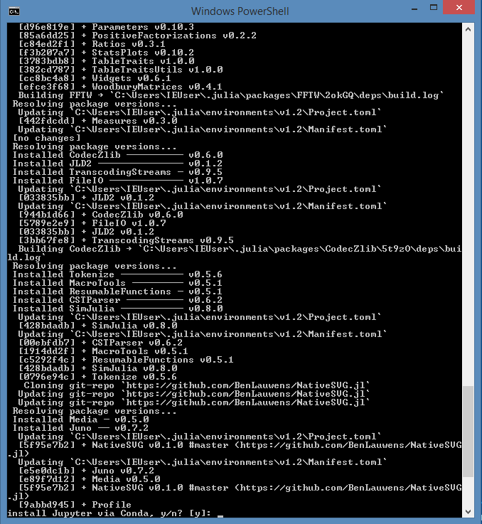
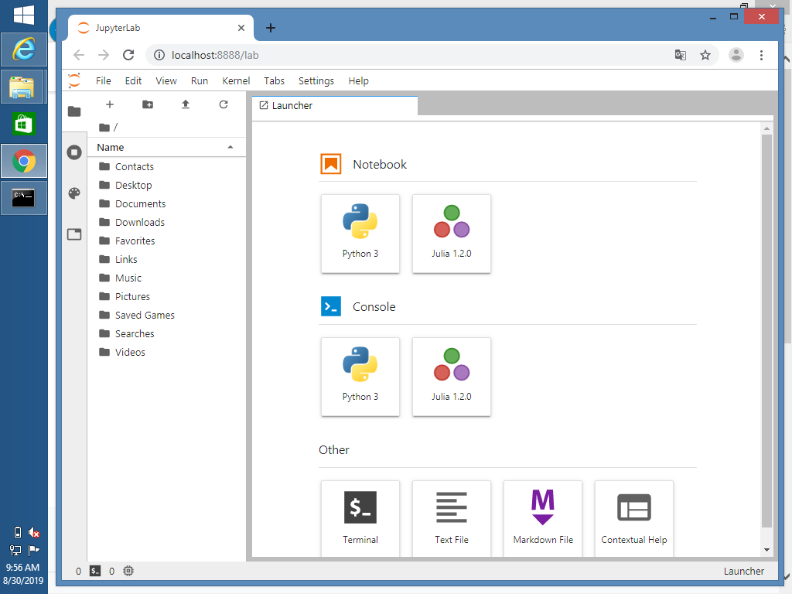

# ES313 - Quickstart guide
We made sure that the installation and configuration runs as smoothly as possible with a minimum of effort on your part. These guidelines work for both Windows and MacOS. Occasionally there is a small difference between the platforms that will be made clear during this walktrough.

This guide has been successfully tested on Windows 10, Windows 8.1, MacOS El Capitan & Mac OS Mojave.

It is recommended that you do all this before attending class, because the installation might take a while. A speedy internet connection is an added value.


## General overview
1. Download Julia 1.2 for your platform from the [website](https://julialang.org/downloads/).
2. Install Julia 1.2
3. Download the [course repository](https://github.com/BenLauwens/ES313.jl) from GitHub and extract the zip file in a folder of your choice (e.g. in 'My Documents')
4. Navigate to the `Setup` folder in the extracted folder. If you are a Mac user, execute `ES313 - MAC.command`. If you are a Windows user, execute `ES313 - WINDOWS.bat`. This small script should activate Julia, fetch all relevant updates, install the required packages and open a new Jupyter Lab home screen.
5. Enjoy the course

#### Remarks:
    
- The first time you run this script, the installer might ask you if you want to install Jupyter via Conda (valid for both platforms). This is required for proper functioning of Jupyter. Input 'yes' when prompted.
- On windows, you might get a warning that Windows Defender has blocked the execution of the script. Disable Windows Defender temporarily or modify the permissions for this file only.
- In the rare case that that the script should not work, you can do the following in the Julia REPL:

    ```Julia
    include("path/to/the/file/configES313.jl)
    ```
    
    
    Where obviously you replace "path/to/the/file/" with the actual location of your file.
- If you only want to run Jupyter Lab without fetching the updates enter the following in the REPL:
    ```Julia
    using IJulia
    jupyterlab()
    ```

## Illustrations
  
   
